### Deep Learning HW 1 Writeup

#### Moons Dataset:
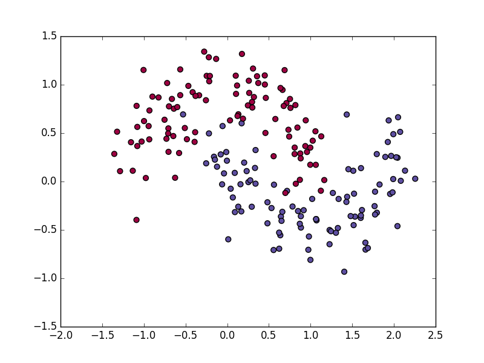

#### 3 Layer Network Training

###### Tanh:
- Gave a tanh-esque curve and a reasonable classification boundry.
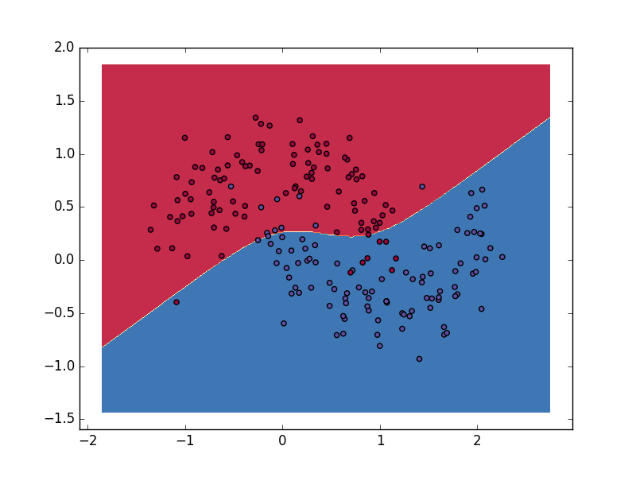

###### Sigmoid:
- Only gave a linear decision boundry and seems to have converged at that value even after messing around with the hyperparameters.
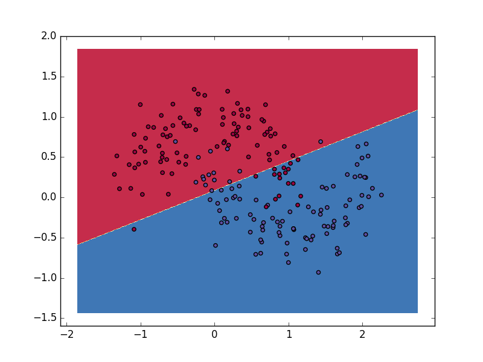

###### ReLU:
- Provided a piecewise linear decision boundry, which makes sense given the activation function. It was interesting to see that this actually showed up in the decision boundry.
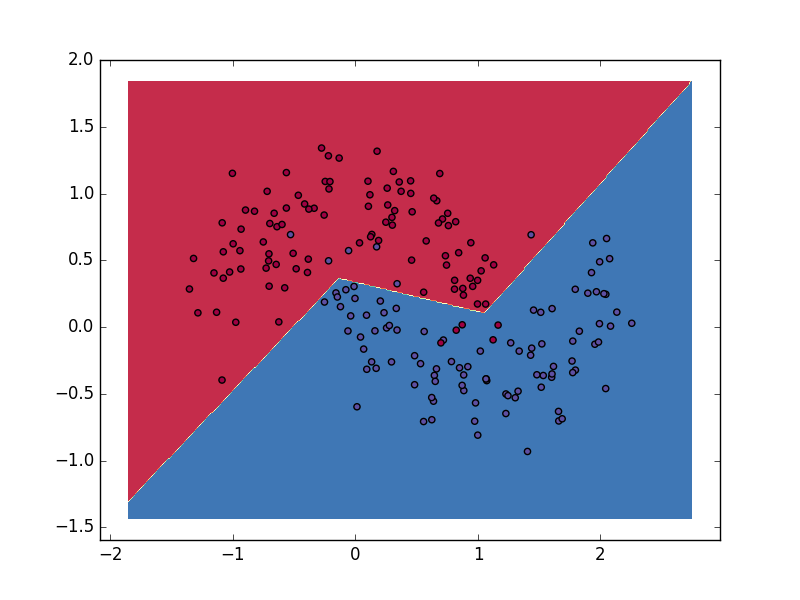

###### Tanh - More hidden units:
- Compared to the lower number of hidden units tanh-network, the one with a larger number of hidden units had a more aggressive decision boundry - more aggressive. It does seem to capture the true distribution better. However, even increasing the number of hidden units by a lot more than I did for this picture ended up with almost the exact final error and resulting decision boundry.
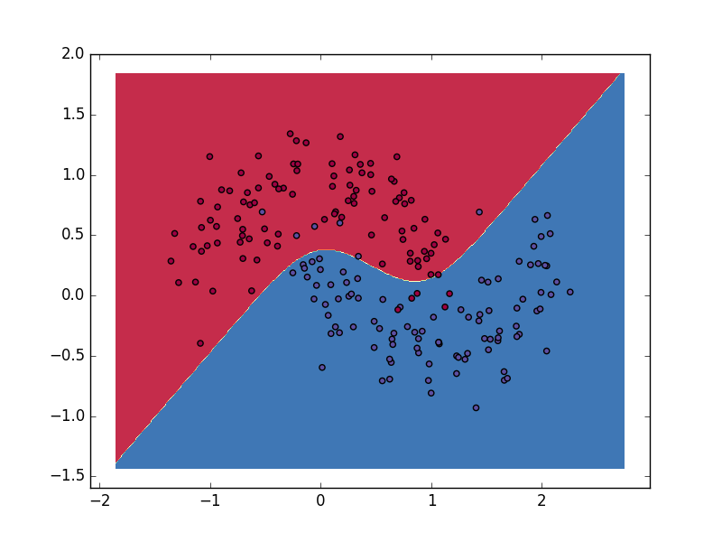

#### Deep Neural Network Training on Moons

###### Attempt 1:
- For this run I tried a 3 hidden layered neural network with 8 neurons in each layer using (tanh, relu, relu) as activation functions for each hidden layer. This network clearly overfit the data with the small circle being drawn inside blue territory to capture the one odd datapoint.
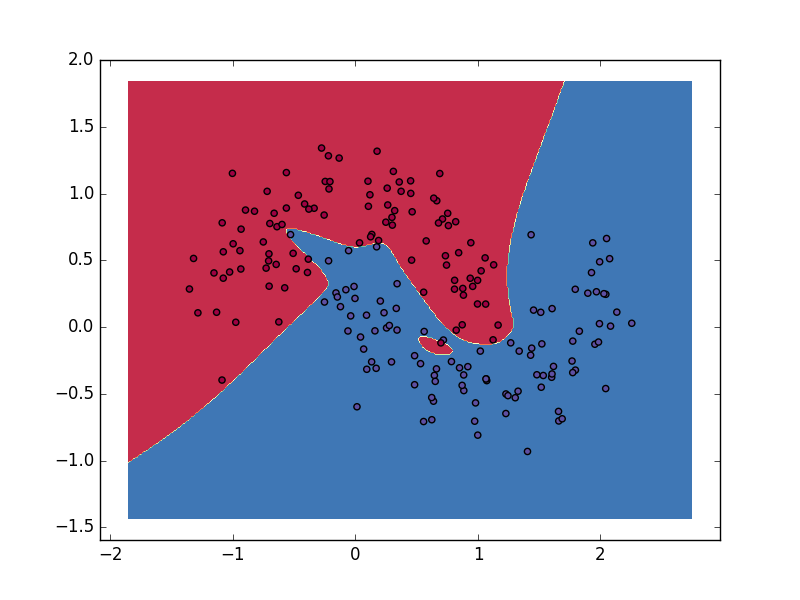

###### Attempt 2:
- I tried to overfit again with a larger network - one with more layers. With a large number of neurons in each layer, I quickly hit overflow so I reduced it to a network of (2,3,3,2) - 4 hidden layers with that number of neurons in each one - and (tanh, relu, tanh, relu) activation functions respectively. I ended up with a fairly reasonable decision boundry though the error jumped around quite a bit during training.
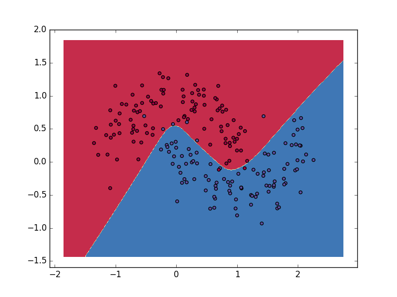

###### Attempt 3:
- I tried the same parameters as above, but halving the learning rate in response to seeing the error jump around a lot. With this change, I ended up with a better decision boundry and error of ~0.03-0.04 less than the previous one.
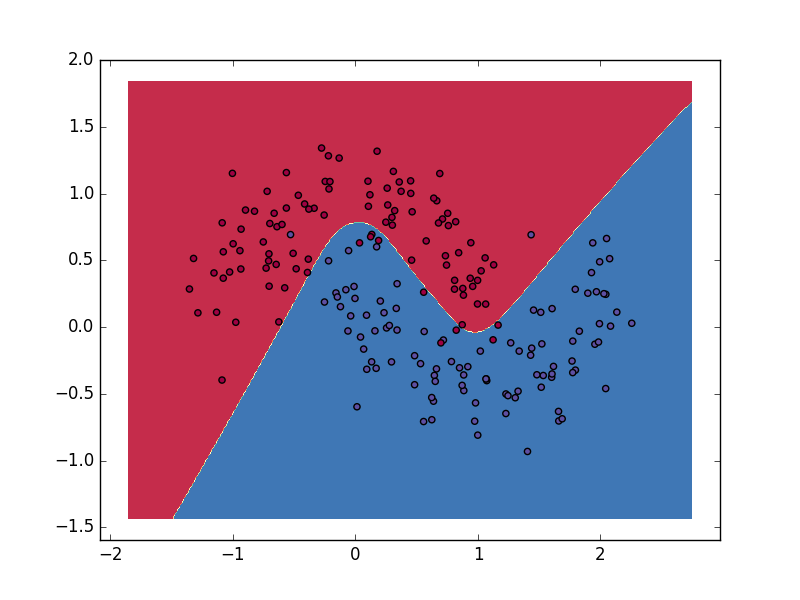

####### Attempt 4:
- Next, I decided to try a much deeper neural network and went for 6 layers of (2,3,4,3,2,2) and ('tanh', 'relu', 'tanh', 'relu', 'tanh', 'tanh', 'relu') activation functions. This function entirely failed to fit the data and got stuck in some strange place in the function landscape - the resulting decision boundry was not even present.
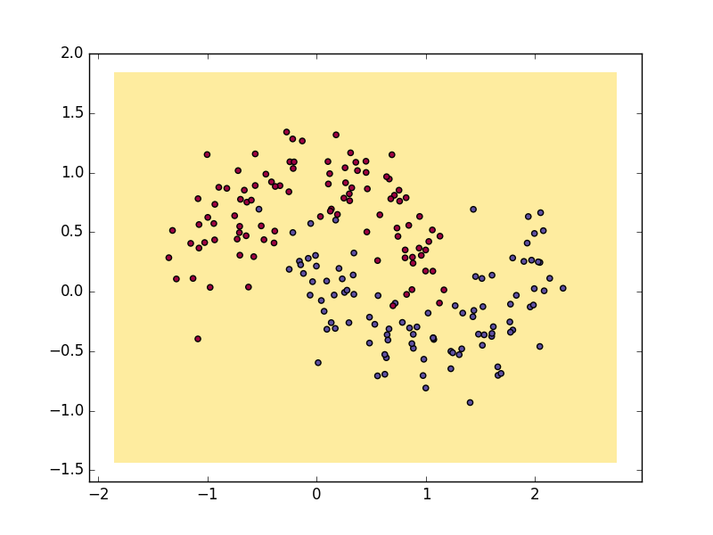

###### Attempt 5 & 6:
- In the next pair of attempts, I tried to do highly varying sizes of hidden layers. In both examples, I used (20, 2, 20) for the sizes of the three hidden layers and tanh for all of the activation functions. In the first one, I started with a learning rate of 0.01 and the decision boundry ended up pretty whacky. After changing the learning rate to 0.001 I ended up with a much more reasonable boundry.
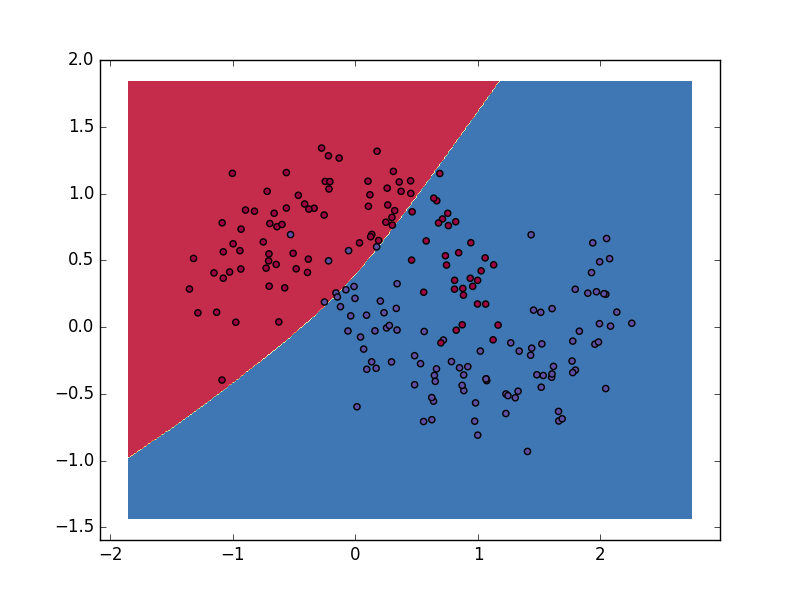
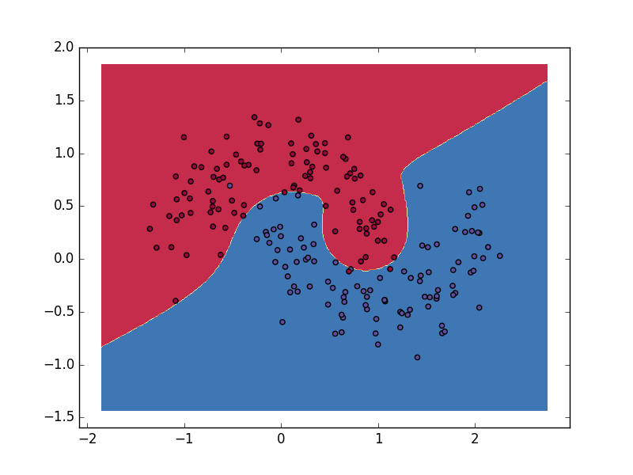

#### Deep Neural Network Training on MNIST
- For my alternative dataset, I decided to try and classify the MNIST dataset that I'll be using for the conv-net part to compare how a standard deepnet does compared to a convolution net. I used the raw pixel value output from the dataset and ran over the entire dataset for each iteration.

###### First attempt:
- Since the dataset is 784-dimensional, I tried starting with what I thought was a large network of (100, 120, 100) with all tanh activation functions.